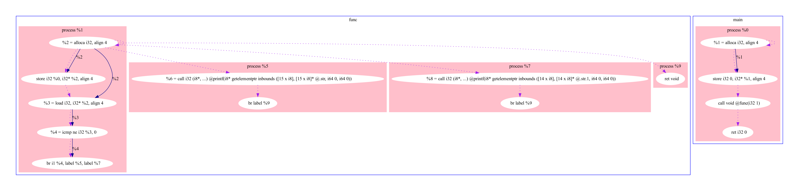

# LLVM_Pass

This program do my own llvm pass to collect some information about executable file

## Requirements 

The following applications have to be installed:

1. CMake 3.1 version (or higher)
2. g++
3. clang
4. LLVM


## Compiling and Run

First you need to create dir build in llvm-pass-skeleton:

``` 
cd llvm-pass-skeleton
mkdir build
cd ../..
```

After that you can run shell script run.sh:
```
./run.sh
```

That script will do all work for you

## Work with script

You can choose the name of the test program about the one that you collect information

You need to enter run.sh and write the filename on the first line (you can choose from files in the test_progs directory)

## Graph 

To open graph enter dir info:
```
cd info
open info.pdf
```

## DOT compile

If you want yourself call dot for any suitable file:
```
dot the_file_name.dot -T pdf -o the_file_name.pdf
```

In this program script already have done it


## Examples

### Simple calc function


### Hello_World!



### Factorial calculating


You can find all this examples in directory images or generate it yourself by changing name of file in run.sh

Dotted purple arrow show order of Instructions and dark blue arrows show which argument was transferred in another instruction

This program accumulates not only static, but also dynamic information: variables that enters function and result of their calculation