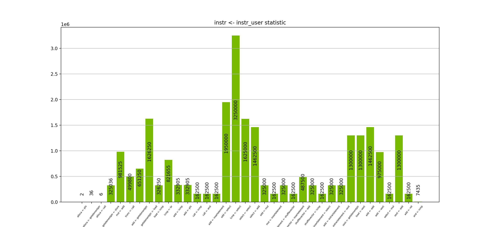

# LLVM Pass

This LLVM Pass logs instructions with their users.

### How to use:

Create pass plugin
```
clang++ Pass_collect_instr.cpp -undefined dynamic_lookup -fPIC -shared -I$(llvm-config --includedir) -o libPass.so
```
Apply pass only for app.cpp file. Statistic will be collected only from this file
```
clang++ -fpass-plugin=./libPass.so ../SDL/app.cpp -O1 -c
```
Compile and run application
```
clang++ ../SDL/main.cpp ../SDL/sim.cpp logger.cpp app.o -lSDL2
./a.out > tmp
```

Collect statistics with python script. Present it in bar chart
```
python3 present.py > instructions_stat.txt
```

